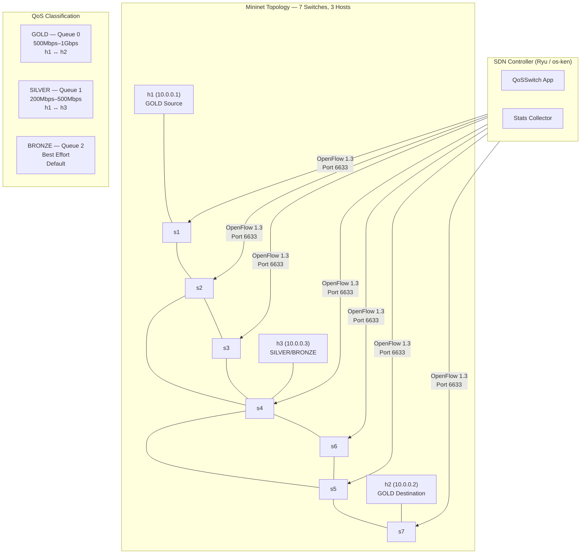

# SDN QoS Project

> Software-Defined Networking controller implementing Quality of Service traffic classification with three service tiers (Gold/Silver/Bronze) using OpenFlow 1.3.


## Architecture



## Features

- **Three QoS tiers**: GOLD (guaranteed high bandwidth), SILVER (moderate bandwidth), BRONZE (best effort)
- **Dynamic MAC learning** with IP-based traffic classification
- **HTB queue configuration** on all OVS switch interfaces
- **Partial mesh topology** with 7 switches and redundant paths
- **Traffic generator** with three patterns: static, bursty (ON/OFF), and oscillating (sinusoidal)
- **Metrics collector** with throughput, latency, Jain's Fairness Index, and matplotlib visualizations
- **Compatible** with both Ryu (legacy) and os-ken (Python 3.12+)

## Tech Stack

| Category | Technology |
|----------|-----------|
| SDN Controller | Ryu / os-ken |
| Protocol | OpenFlow 1.3 |
| Network Emulation | Mininet |
| Virtual Switch | Open vSwitch (OVS) |
| Traffic Testing | iperf3 |
| Visualization | matplotlib |
| Language | Python 3 |

## Getting Started

### Prerequisites

- Linux environment (Mininet requires it)
- Python 3.8+ (or 3.12+ with os-ken)
- Mininet, Open vSwitch, iperf3
- `pip install ryu` or `pip install os-ken`

### Installation

```bash
git clone https://github.com/g-holali-david/sdn-qos-project.git
cd sdn-qos-project
pip install ryu  # or: pip install os-ken
```

### Usage

```bash
# Terminal 1 — Start the SDN controller
python3 run_controller.py 6633

# Terminal 2 — Start the Mininet topology
sudo python3 scripts/topology.py --controller-port 6633

# Terminal 3 — Generate traffic (from within Mininet or separately)
python3 scripts/traffic_generator.py --pattern bursty --target 10.0.0.2 --rate 100M --on 5 --off 2

# Terminal 4 — Collect metrics and generate graphs
python3 scripts/metrics_collector.py --full-test --duration 120 --output results/
```

## Project Structure

```
sdn-qos-project/
├── run_controller.py              # Controller launcher (auto-detects ryu/os-ken)
├── run_all.sh                     # All-in-one startup script
├── ryu_apps/
│   └── qos_switch.py              # QoS-aware OpenFlow switch + stats collector
└── scripts/
    ├── topology.py                # Mininet topology (7 switches, 3 hosts, QoS queues)
    ├── traffic_generator.py       # Static / Bursty / Oscillating traffic patterns
    ├── metrics_collector.py       # Throughput, latency, fairness metrics + plots
    └── run.sh                     # Helper run script
```

## Author

**Holali David GAVI** — Cloud & DevOps Engineer
- Portfolio: [hdgavi.dev](https://hdgavi.dev)
- GitHub: [@g-holali-david](https://github.com/g-holali-david)
- LinkedIn: [Holali David GAVI](https://www.linkedin.com/in/holali-david-g-4a434631a/)

## License

MIT
